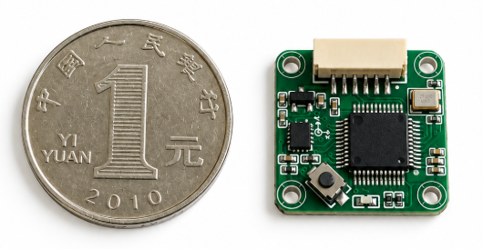
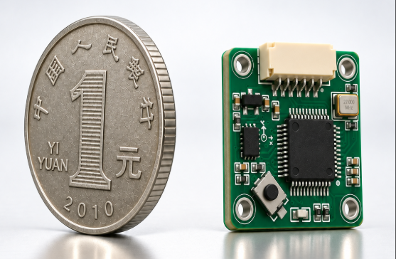

<h1 align="center">CJ02-IMU</h1>

<p align="center">
  <strong>迷你六轴 IMU 传感器 · ESKF 姿态解算 · 最高 1600 Hz 输出</strong>
</p>

<p align="center">
  <a href="LICENSE"></a>
  <a href="https://creavisiontech.github.io/CJ02-IMU/"></a>
  <a href="docs/PROTOCOL.md"></a>
</p>

<p align="center">
  
  
</p>

<p align="center">
  <sub>正视尺寸对比&nbsp;&nbsp;·&nbsp;&nbsp;立体视角展示</sub>
</p>

<p align="center">
  <a href="https://creavisiontech.github.io/CJ02-IMU/"><strong>在线 Dashboard</strong></a>
  &nbsp; · &nbsp;
  <a href="#快速上手">快速上手</a>
  &nbsp; · &nbsp;
  <a href="docs/PROTOCOL.md">通信协议</a>
  &nbsp; · &nbsp;
  <a href="sdk/python">Python SDK</a>
  &nbsp; · &nbsp;
  <a href="sdk/cpp">C++ SDK</a>
</p>

---

## 简介

CJ02-IMU 是一款高性能迷你六轴惯性测量单元（IMU），内置 ESKF（误差状态卡尔曼滤波器）实时姿态解算，以可配置的 **1600/800/400/200 Hz** 频率通过 UART 输出原始传感器数据和融合姿态角。

### 核心特性

| 特性 | 规格 |
|------|------|
| 姿态输出频率 | 1600 / 800 / 400 / 200 Hz（默认 800 Hz） |
| 内部采样频率 | 1600 Hz |
| 加速度计量程 | ±16 g |
| 陀螺仪量程 | ±2000 °/s |
| 静止漂移（roll/pitch） | < 0.05°/min |
| 静止漂移（yaw） | < 0.1°/min |
| 外部触发同步精度 | 0.625 ms |
| 通信接口 | UART 460800 / 2000000 bps 8N1 |
| 供电 | 3.3V |

常规 1600 Hz 双帧输出需要能稳定支持 2 Mbaud 的 USB-UART。板载 WCH 调试器串口在本机实测高速连续流会丢字节，使用它时请选择 800/400/200 Hz；网页振动采集采用 1600 Hz 原始帧专用模式，可在默认 460800 baud 下稳定运行。

### 在线工具

- **[Web Dashboard](https://creavisiontech.github.io/CJ02-IMU/)** — 浏览器直接连接串口，实时查看 3D 姿态、原始数据和曲线，可在线修改 ESKF 参数，并通过交互式向导完成电机关闭基线、实际工况、振动频谱、滤波方案离线重放和上机复测。

振动分析在浏览器本地完成，采集内容不会上传。每段采集至少 3 秒，建议基线采集 5–10 秒；工况采集应覆盖实际转速、负载和运动范围。分析器使用 1 秒 Hann 窗和 50% 重叠，在 15–700 Hz 范围内比较工况与基线，输出加速度计/陀螺仪陷波中心、Q 值、低通截止频率及滤波前后高频 RMS。生成的 JSON 报告可以直接从页面下载。

---

## 快速上手

### 方式一：Python（最简单）

```bash
# 安装依赖
pip install pyserial

# 运行示例（Linux）
python sdk/python/example.py /dev/ttyUSB0

# 运行示例（Windows）
python sdk/python/example.py COM11
```

输出：
```
Connected to CJ02-IMU on /dev/ttyUSB0 @ 460800 baud
R=  12.34°  P=  -5.67°  Y=  89.12°  mode=RUN     zaru=True  static=True  [798 Hz]
```

### 方式二：C++

```bash
cd sdk/cpp
mkdir build && cd build
cmake .. && make

# 运行
./cj02_example /dev/ttyUSB0     # Linux
./cj02_example.exe COM11        # Windows
```

### 方式三：Web Dashboard（零安装）

1. 用 Chrome 或 Edge 打开 [在线 Dashboard](https://creavisiontech.github.io/CJ02-IMU/)
2. 点击「连接串口」选择对应 COM 口
3. 即可看到实时 3D 姿态、原始数据、曲线图

### 方式四：ROS1

```bash
# 复制到 catkin 工作空间
cp -r ros/cj02_imu_node ~/catkin_ws/src/
cd ~/catkin_ws && catkin_make

# 运行
source devel/setup.bash
rosrun cj02_imu_node cj02_imu_node _port:=/dev/ttyUSB0

# 查看话题
rostopic hz /imu/data        # 应显示 ~800 Hz
rostopic echo /imu/attitude  # 欧拉角
```

### 方式五：ROS2

```bash
# 复制到 colcon 工作空间
cp -r ros2/cj02_imu ~/ros2_ws/src/
cd ~/ros2_ws && colcon build --packages-select cj02_imu

# 运行
source install/setup.bash
ros2 run cj02_imu cj02_imu_node --ros-args -p port:=/dev/ttyUSB0

# 查看话题
ros2 topic hz /imu/data
ros2 topic echo /imu/attitude
```

---

## 项目结构

```
CJ02-IMU/
├── README.md                 # 本文件
├── LICENSE                   # MIT 许可证
├── docs/
│   └── PROTOCOL.md           # 通信协议详细文档
├── sdk/
│   ├── cpp/
│   │   ├── include/
│   │   │   └── cj02_imu.h    # C++ SDK（header-only）
│   │   ├── src/
│   │   │   └── example.cpp   # C++ 示例程序
│   │   └── CMakeLists.txt
│   └── python/
│       ├── cj02_imu.py       # Python SDK
│       ├── example.py        # Python 示例
│       └── requirements.txt
├── ros/
│   └── cj02_imu_node/        # ROS1 驱动节点
│       ├── package.xml
│       ├── CMakeLists.txt
│       └── src/cj02_imu_node.cpp
├── ros2/
│   └── cj02_imu/             # ROS2 驱动节点
│       ├── package.xml
│       ├── CMakeLists.txt
│       └── src/cj02_imu_node.cpp
├── dashboard/
│   ├── index.html            # Web Dashboard（GitHub Pages 部署）
│   ├── vibration.js          # 浏览器端振动采集、FFT、滤波重放和复测
│   └── vibration.css         # 振动分析向导样式
└── .github/
    └── workflows/
        └── pages.yml         # GitHub Pages 自动部署
```

---

## 数据输出

CJ02-IMU 以可配置频率输出两种数据帧（详见 [通信协议](docs/PROTOCOL.md)）：

| 数据 | 帧头 | 内容 | 频率 |
|------|------|------|------|
| 原始数据 | `0xAA` | 加速度 (mg) + 陀螺仪 (°/s) | 1600/800/400/200 Hz |
| 姿态角 | `0xAB` | roll/pitch/yaw (°) + 模式 + 标志 | 1600/800/400/200 Hz |
| 同步事件 | `0xAD` | 外部触发时间戳 + 当时姿态 | 异步 |
| 配置 | `0xAC` | 参数读写命令/回复 | 按需 |

**Python 快速读取：**

```python
from cj02_imu import CJ02IMU

imu = CJ02IMU()
imu.on_attitude = lambda f: print(f"roll={f.roll:.2f}°")
imu.open("/dev/ttyUSB0")
imu.run()
```

**C++ 快速读取：**

```cpp
#include "cj02_imu.h"
cj02::CJ02IMU imu;
imu.onAttitude([](const cj02::AttitudeFrame& f) {
    printf("roll=%.2f\n", f.roll);
});
imu.open("/dev/ttyUSB0");
imu.run();
```

---

## ROS 话题

ROS1 和 ROS2 节点发布相同的话题：

| 话题 | 消息类型 | 内容 | 频率 |
|------|---------|------|------|
| `/imu/data_raw` | `sensor_msgs/Imu` | 原始加速度 + 角速度 | 800 Hz |
| `/imu/data` | `sensor_msgs/Imu` | 含姿态四元数 | 800 Hz |
| `/imu/attitude` | `geometry_msgs/Vector3Stamped` | 欧拉角 (roll/pitch/yaw, °) | 800 Hz |

---

## 外部触发同步

CJ02-IMU 支持外部传感器触发同步功能：

1. 将外部传感器（如相机）的触发信号连接到传感器的 SYNC 输入引脚
2. 每次触发脉冲到来时，传感器会插入一个 `0xAD` 同步帧到数据流
3. 同步帧包含触发时刻的内部采样计数器（1600 Hz 分辨率）和当时的姿态角
4. 上位机可通过 `trigger_seq` 精确对齐外部事件与 IMU 数据（精度 0.625 ms）

**Python 监听同步事件：**

```python
imu.on_sync = lambda f: print(f"外部触发! seq={f.trigger_seq} R={f.roll:.1f}°")
```

---

## 配置参数

通过串口命令（`0xAC` 帧）可在线修改传感器参数并持久化到内部 Flash（断电不丢失）。支持的参数包括：

- ESKF 滤波器参数（陀螺噪声、零偏漂移、ZARU 方差等 17 项）
- 静止检测阈值
- 触发输出分频和占空比

详见 [通信协议 §5 配置参数](docs/PROTOCOL.md#5-配置参数80-字节负载)。

网页振动向导还可以配置加速度计和陀螺仪各 3 组固定陷波、独立二阶低通、
输出频率和波特率。软件滤波默认关闭，只作用于 ESKF 输入，原始数据始终保留。
推荐先临时应用到 RAM，重复相同工况验证后再保存到 Flash。

---

## 文档

- [通信协议](docs/PROTOCOL.md) — 帧格式、校验算法、配置命令、参数表

---

## 许可证

[MIT License](LICENSE)

---

## 购买与技术支持

- 官方网站：[Creavision Tech](https://creavision.tech)
- 技术支持：support@creavision.tech
